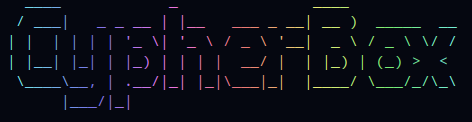

# CypherBox

A minimalist Cryptographic CLI tool

- generate and keep track of your accounts (like wallets)
- it can be used for signing, encrypting and decrypting messages
- signing keys are diffrent from encryption keys and both are generated from a password that the user provides
- each public key is an account with an associated name
- each account has three folders, Signed, Decrypted and Encrypted located in .config/cypherBox/AccountName/
- cypherBox setting are in .config/cypherBox/settings.json
- only public keys are stored and only one private key is selected at any time
- Visual Appearance might differ depending on your terminal color settings (consider it a feature ;=) )
